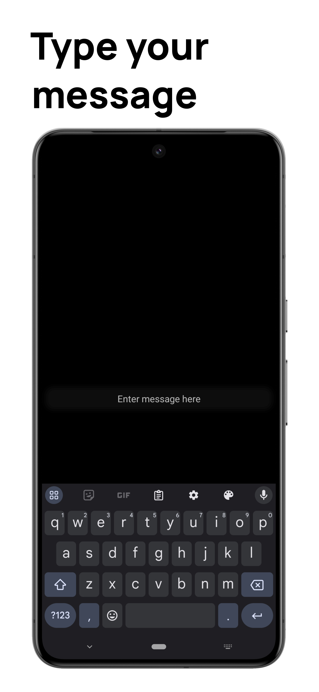
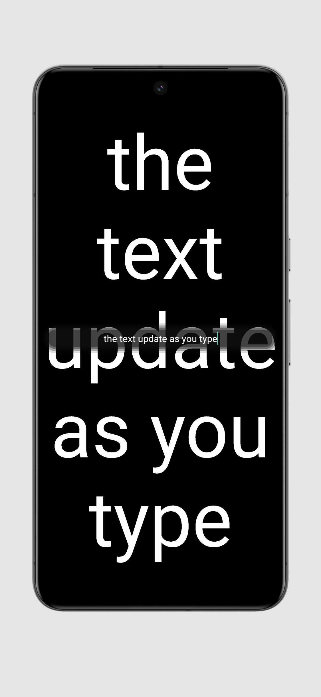
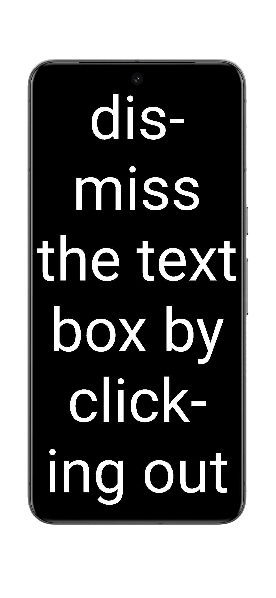
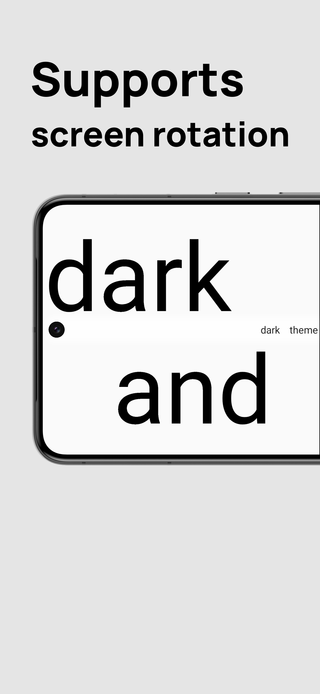
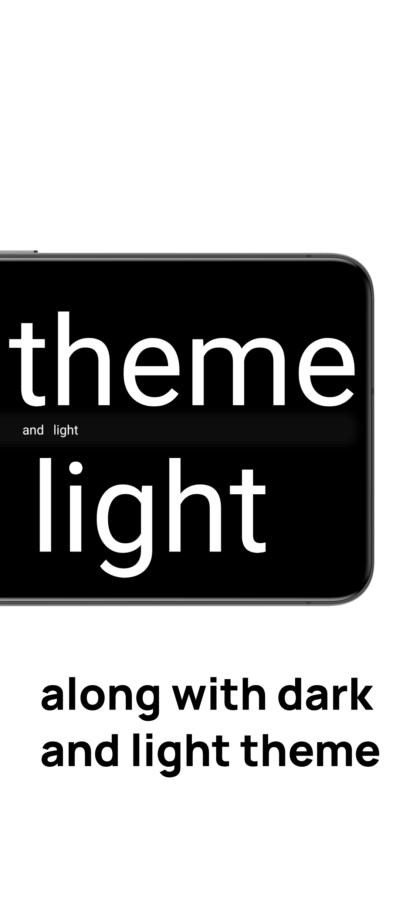

#  screen-message

A simple app to display some text as large as possible.

> Inspired by [nomeata/screen-message](https://github.com/nomeata/screen-message)

### Download
<!-- not ready yet

-->

---

### Features:
- Dark and Light theme support
- Landscape + Portrait mode support
- Lightweight in size
- No ads
- Low memory usage

 

[//]: # (- Anti-feature\(s\):)
[//]: # (  - TBD)

### Usage:
- Tap anywhere on the screen to open the keyboard
- Enter text to display
- Tap outside the text box to close the keyboard and display the message

<h3>Use cases:</h3>

- Showing a message to a friend across the room
- Displaying a text outside the window

### Images

TODO:

- [ ] Figure out where to add option for changing background color and text color
- [ ] Maybe: Add ability to share text to this app
- [ ] No idea if possible: Keep the app open, but have another device send text to it?
  - seems kinda complicated, and would make this not a simple app anymore... :P
